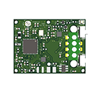

# 小明开源-物联网温度贴
#采用超小体积BLE和WIFI双模SOC芯片
#完全开源，包括硬件原理图，PCB，外壳，嵌入式源代码等所有
#点击观看视频介绍>>

#功能特点如下：

#量度温度，可达医疗级
Medical Level for Measurement of Temperature	
与医疗仪器比较±0.1度摄氏
±0.1℃ compared with Medical Instruments

#通讯功能
Communication	
低功耗WiFi 自动联网
Low Consumption to connect nearby WiFi Automatically
实时数据独立上传
Real Time Transmission

#定位
Location	
佩戴者地点定位
Positioning & Location of the Wearer

#电源
Power Source	
锂电池，可用48小时、磁吸充电
Lithium Battery by Magnetic Charging for use in 48 hours

#后台及小程序
Platform & Applets
实时数据监测
Real Time Data Monitoring
温度异常预警
Alerts of Abnormal Temperatures
实时数据一键分享多人
One-click Sharing of Real Time Data to Unlimited No. of People

#开发环境

#硬件设计
KiCAD

#软件设计
Keil uVision5

#外壳设计
Solidworks 2018
